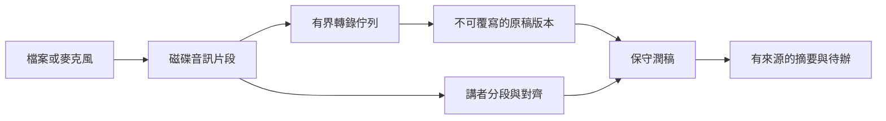

# 會議轉錄與整理提案

查核日期：2026-09-20。**本文件是規劃，以下新功能尚未實作**；不併入目前翻譯／快捷鍵切換的修改。

建議先完成「匯入錄音→完整逐字稿」，再加入錄製中的字幕與講者標籤。沿用原生 App、現成 Whisper／Sherpa 與文字整理服務；不加常駐 daemon、Python 環境或重量網頁介面。模型需要時才下載、工作開始才載入，會議結束後釋放。

## 目前能重用什麼

- `VoiceServiceProtocol` 只有單次錄音、最終字串與可選暫時字幕；`VoiceTranscriptionSnapshot` 保存原稿／繁轉稿，但沒有段落時間、講者、進度或續作資訊。
- `WhisperVoiceService.caption()` 每 3 秒重新辨識末 15 秒；這是滾動暫稿，不是可累加的完整直播逐字稿。`WhisperAudio` 在記憶體累積 16 kHz 單聲道 PCM，30 分鐘後拒絕輸出；不適合直接延長成兩小時會議。
- `WhisperRuntime` 每次組成整份音訊 HTTP body，只取回 `text`，一次處理一個請求。現有取消／session token 可參考，會議需要檔案輸入、時間段及資源排程的新介面。
- Google 目前是 V1 `speech:recognize`，Groq／SenseVoice 也是錄完才處理；沒有串流講者功能。已存在的服務選項不等於已支援會議。
- `TranscriptHistoryStore` 是最多 200 筆、2 MB 的短口述文字紀錄，不存音訊；會議須獨立儲存。`UserStyleModel` 只記接受次數、自訂指令等，沒有訓練聲音或學習講者身分。
- `vendor/sherpa` 的 header **及 dylib 匯出符號**已包含 `SherpaOnnxCreateOfflineSpeakerDiarization`／SpeakerEmbedding。值得重用，但尚無分人模型、Swift 接線及實測。

## 使用者會看到的流程

1. **匯入錄音**：拖入 WAV／M4A／MP3，顯示時長、語言、處理位置與容量，選擇後開始。「匯入」預設本地處理；選雲端才傳送音訊。格式以 AVFoundation 實際可解碼為準，不能讀的檔案清楚說明。
2. **現場會議**：按開始→錄製、暫停、繼續、結束；字幕逐段出現，已確定段落才能潤稿。主窗可縮起，選單列仍顯示錄製與待處理狀態。
3. **回看與輸出**：原始逐字稿／保守潤稿／摘要待辦三頁，點時間可聽原音。匯出 TXT、Markdown；有足夠時間資料才提供 SRT／VTT。不同講者顯示「講者 1／2」，使用者可命名、合併與更正；不猜姓名、性別或身分。

麥克風不等於會議軟體聲音。Zoom／Meet 等系統音訊另列範圍：使用 ScreenCaptureKit、明確選擇來源、取得相應系統權限，分開保留本機麥克風與遠端音軌，測試回音與重複收音。依 API 版本另做功能限制，不為此提高整個 App 的最低系統。參考 [Apple 音訊擷取範例](https://developer.apple.com/documentation/screencapturekit/capturing-screen-content-in-macos)。

## 官方能力與選型

| 方案 | 已查核能力／限制 | 建議用途 |
|---|---|---|
| 本地 Whisper + Sherpa | Whisper 可分窗轉錄；官方 tinydiarize 是實驗性換人標記，示例需要專用 `small.en-tdrz`，不能當成現有 Turbo 的中文講者分離。Sherpa 的離線 C API 組合分段模型、聲音特徵與聚類 | 本地檔案優先；先驗證會後分人，再研究暫時講者 |
| Deepgram Nova-3 | 支援直播轉錄與講者；目前串流 diarizer 為 v1，v2 為檔案用途。語言表有 `zh-TW`，但 `multi` 的列舉語言不含中文 | 若優先要求即時分人，可做單一雲端候選；中英夾雜須實測 |
| OpenAI | `gpt-4o-transcribe-diarize` 的檔案輸出可帶 speaker／起迄時間；不是 Realtime 講者。現行即時文件推薦 `gpt-live-transcribe`，但明示不回講者及逐字時間 | 檔案分人候選，或即時文字加會後分人 |
| Google Cloud STT V2 | 泛用 diarization 文件提及串流，但 Chirp 3 專頁將分人限制在完成錄音的方法；台灣華語轉錄支援不代表分人支援 | 不因現有 Google Key 就承諾即時分人；先核對地區、語言、模型與驗證方式 |

依據：[Whisper 官方說明](https://github.com/ggml-org/whisper.cpp#speaker-segmentation-via-tinydiarize-experimental)、[Sherpa C API](https://k2-fsa.github.io/sherpa/onnx/c-api/html/speaker_diarization.html)、[Deepgram 分人](https://developers.deepgram.com/docs/diarization)與[語言表](https://developers.deepgram.com/docs/models-languages-overview)、[OpenAI 檔案轉錄](https://developers.openai.com/api/docs/guides/speech-to-text)與[即時轉錄](https://developers.openai.com/api/docs/guides/realtime-transcription)、[Google Chirp 3](https://docs.cloud.google.com/speech-to-text/docs/models/chirp-3)。這是能力核對，不是準確率排名。

本地方案需另測分人模型授權、下載容量、Apple Silicon 效能與重疊發言；目前只證實原生 API 存在。先不導入 PyTorch／WhisperX 整套環境。若選雲端，只實作選中的一個供應商，不把所有 SDK 一次加入。

雲端須按服務限制切檔：例如 OpenAI 檔案上限 25 MB，diarize 超過 30 秒須設定分塊策略；串流回覆不代表可無限長上傳。

## 建議架構與長錄音保護

新增獨立 Meeting coordinator／store／window，不把會議塞入日常 `InputController`。短口述 protocol 維持相容；會議引擎回傳帶 `segmentID、start/end、revision、provisional/final、speakerID?` 的事件，不能把到達順序當時間順序。共享麥克風與模型的排程須有單一擁有者，拒絕衝突並顯示原因，不能互相取消或偷偷搶音訊。

**磁碟先行**：錄音分段連續寫入，建議從 30 秒片段、固定大小 ring buffer 起測；音訊 callback 不做網路或 AI。每段記來源音軌、起始 sample、校驗碼及處理狀態，完成片段才原子提交；崩潰後掃描並重試未完成段。匯入檔只讀，另存一份可恢復的分段資料，不反覆複製整份原檔。16 kHz／16-bit 單聲道約 115 MB／小時，每多一軌另計。

**紀錄分開**：會議目錄位於 Application Support，音訊與版本資料不進 Git／build。建議用系統 SQLite 保存段落、工作與修訂，單一寫入佇列、交易與 schema version；沒有新資料庫服務。UI 用原生可重用列，只載入正在看的段落。保留期限、容量上限、刪除原音均有明確操作；不以「清 build」刪會議。

**有限並行**：先允許一個辨識工作及一個整理工作；推論落後就降低暫稿頻率並顯示待處理時長，錄音仍落磁碟。同一模型只載入一份；缺模型時提示按需下載，沿用大小／SHA-256 驗證。雲端斷線保留佇列，不靜默切換供應商或重複上傳整場。

## 暫稿、講者與 AI 的界線

- 暫稿可替換；段落確認後才進入整理。結束後從完整磁碟音訊再校正分段邊界、漏字及講者，保留前版差異。視窗重疊要依時間與文字去重，不能直接把每次末 15 秒字幕串起來。
- 分人是聲音分群，非身分辨識。不同音訊片段／重連的「Speaker 1」未必同人，需全會議一致的映射與會後重整；不確定、同時發言或極短插話可標「講者未定／重疊」，可人工修正。
- 本地分人也須分窗抽取特徵、跨窗聚類；不能把兩小時音訊轉成一整份 float 陣列送入離線 API。這部分須先做容量與準確性原型。
- 保守潤稿保留人名、金額、否定與不同意見；只處理同一講者明確改口，不把甲說三點、乙主張四點合併為已決議四點。原稿永不被 AI 覆蓋。
- 摘要／決議／待辦每條都帶來源段落與時間。負責人、日期未明說就留待確認；紀錄不是指令，不讓 AI 執行工具或寄出消息。重用 Gemini／Apple／Codex／Claude 文字能力，新增會議專用提示；既有 Learning 不自動訓練、不跨會議建立聲紋庫。
- 只對已變更段落重新整理；快取鍵包含段落版本、服務及提示版本。使用者編輯後，遲到的 AI 回應不可蓋掉新稿。

## 分階段交付與驗收

1. **檔案 MVP**：本地匯入、完整時間段逐字稿、播放定位、保守潤稿、匯出、暫停續作；講者先可手動標記。先以 10／30／120 分鐘音訊驗證無截斷及崩潰恢復。
2. **會後分人與整理**：Sherpa 模型小規模驗證；若效果不足，再由使用者選擇雲端檔案分人。完成講者映射、手動修正、有來源摘要待辦。
3. **現場麥克風**：磁碟錄製、暫稿、逐段潤稿與完成後校正；暫時講者只有通過本地或選定雲端實測才開啟。系統音訊另一期。

共同驗收：中英夾雜、人名、數字、同段改口、兩人／多人／重疊發言都要有人校正的基準。記錄字詞錯誤、漏段、講者錯配及延遲，不引用廠商排名當本機成果。建議即時 P95 字幕延遲目標 5 秒，須標註硬體／模式；達不到就顯示實際落後，不能假稱即時。兩小時測試的記憶體不得隨時長線性增加；模擬斷網、睡眠、音源拔除、磁碟滿、取消與重啟，完整已提交段不重複、不消失。摘要每條來源可點開，人工改稿不被覆蓋，關閉會議後不得有新增常駐音訊工作。原有聽寫、翻譯、快捷鍵、詞庫與紀錄都要回歸測試。

## 成本、隱私與待決定項

本地省去按分鐘雲端費用，但占模型儲存、記憶體與電池；雲端降低本機負載，但傳送音訊，長會議、重試與會後第二次轉錄都可能計費。AI 整理另按所選服務計算；不預設 CLI 訂閱無額度限制。實作前查當期帳戶價格、資料留存／模型改進選項，顯示估算與花費上限，不在此填未核對單價。

啟動錄音前顯示來源、處理位置與錄製狀態，錄製中維持明顯指示。雲端音訊與雲端文字整理分開選；選本地辨識不代表後續文字也留本機。

待決定：① 本地優先，或優先取得雲端即時講者；② 主要語言、人數及典型時長；③ 可接受字幕延遲；④ 原音保留期限及磁碟上限；⑤ 首期是否包含會議軟體系統音訊。建議預設先做檔案與麥克風、本地優先、原音保留至使用者確認完成，雲端另行選擇。
