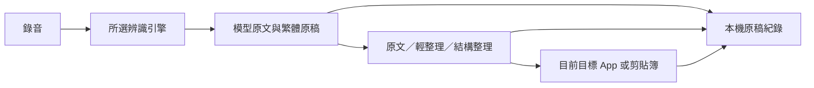

# Input-sa × Talky 整合研究

日期：2026-09-19。狀態：v3.0.0 完整整合實作與測試完成；正式發布、安裝結果由發布流程確認。
比較基線：`7b80507`；Talky 固定參考：`9fd3ab7ab2c8c0536e6d37103edaa777ec31cf67`。
使用者確認：語音辨識錯誤、AI 過度改寫兩種問題都常見。

## 1. 建議決策

以 Input-sa 為主體，分別改善「聽對、少改、能找回」，吸收 Talky 的本地 Whisper 支援與操作體驗。不要把兩個 App 同時啟動，也不要整份覆蓋主控制器。

先解決會把正確文字改壞的校正規則，保留每階段文字，再比較引擎。介面改善與辨識準確率要各自驗收。

## 2. 改動前專案實況（基線 7b80507）

- Swift／AppKit 選單列 App，以 CGEventTap 接快捷鍵、剪貼簿與合成 ⌘V 輸入文字。雖然目錄叫 InputMethod，主流程並非傳統 InputMethodKit 輸入法。
- 實際建置入口為 `build.sh` 裸編譯；新增檔案要加入它的來源清單，不能只改 Xcode 專案。
- 語音支援 Groq Whisper、Google STT、Sherpa；Sherpa 優先載入 SenseVoice，缺少時才找 Paraformer。介面仍標「本地 Paraformer」，容易混淆實際模型。
- 本機偏好唯讀確認：`voiceProvider=sherpa`、`polishProvider=gemini`、`dojoMode=1`。這不是以 README 預設值推測。
- 已有道場詞庫、口頭加詞、共編詞庫、自訂 AI 模式、七組可改快捷鍵、語音／劃詞翻譯、劃詞問答、用量統計與診斷。
- 現在的 HUD 主要呈現角色、波形與狀態；設定頁是系統設定式側欄。既有素材與未追蹤的 `design-refs/` 保留。

改動前主要路徑：

當時限制：Sherpa 傳回的文字已經過校正，所以 AI 失敗時退回的「原稿」不一定是模型原始辨識結果。雲端與本地的校正順序也不同；v3.0 已分開保留模型原文與繁體原稿。

## 3. 改動前的誤改機制（行號對應基線）

| 機制 | 證據與影響 |
|---|---|
| 標準模式允許整段重寫 | `TranscriptionMode.swift:111` 要求以整段語意重新整理；與「只補標點、保留我說的話」不同。 |
| 詞庫不檢查語境 | `DojoCorrectionTable.swift:109,202` 先全字串替換，再做無聲調拼音滑窗。領域模式開著時，一般詞也會被替換。 |
| Gemini 缺少保真驗證 | `GeminiPolishService.swift:275` 主要檢查非空；沒有數字、否定、人名保留檢查。Apple 有長度守衛，但也不能保證原意。 |
| 正常口述直接貼上 | `InputController.swift:810` 整理成功後再次校正並注入。手動潤飾有接受／拒絕，普通口述沒有同等的前後比較。 |
| 個人化資料不足 | `UserStyleModel.swift` 保存模式與接受／拒絕計數，沒有依使用者改字自動學習的流程。上一輪已整理文字還會送入下一輪 Gemini 上下文，可能延續錯誤。 |

**純本地實跑結果**（使用 repository 內建詞庫，不讀個人詞庫、不呼叫 AI）：

| 構造測試句 | 道場關閉 | 道場開啟 |
|---|---|---|
| 今天休班 | 今天休班 | 今天修辦 |
| 請證人出席 | 請證人出席 | 請聖人出席 |
| 我去找李雲 | 我去找禮運 | 我去找禮運 |

既有詞庫測試 17 項全過，但未覆蓋上述合法詞彙。這證明部分問題在校正规則本身；尚不能推算使用者實際錯誤率。

程式依據：[整理提示詞](/Users/gooo/Desktop/.claude/projects/input-sa/InputSa/AIServices/TranscriptionMode.swift:111)、[詞庫](/Users/gooo/Desktop/.claude/projects/input-sa/InputSa/AIServices/DojoCorrectionTable.swift:109)、[主流程](/Users/gooo/Desktop/.claude/projects/input-sa/InputSa/InputMethod/InputController.swift:779)。

## 4. Talky 可借用什麼

| 面向 | Talky 實作 | 整合判斷 |
|---|---|---|
| 本地辨識 | whisper.cpp + large-v3-turbo，約 1.6 GB 模型，Metal 加速 | 新增可選引擎；保留 SenseVoice。既有 Groq 也是 Whisper turbo 家族，不能當作全新辨識能力。 |
| 即時文字 | 每 1.4 秒重辨識最後 45 秒，停止後整段重辨識 | 改善可見性；尚非 VAD 切句或真正增量串流，長口述仍要等。 |
| 常用詞 | 詞庫同時送入 Whisper prompt 與 AI；STT 詞庫上限 120 字 | 專有名詞在辨識階段就提供提示，值得採用；提示不等於模型訓練或保證命中。 |
| 整理與退路 | 多後端、可不整理，失敗可退本機／原稿 | 借路由與明確狀態；先保留 Gemini／Apple，其他後端按需要追加。 |
| 操作介面 | 軟浮雕、淺深色、文字型面板、語言籤、一般／進階設定、首次引導 | 借資訊層級與操作回饋，保留 Input-sa 身份與功能。 |
| 最近口述 | 最近 20 句，可再次複製 | 值得做，但 Talky 只存最終文字；本專案應多存原文及改動。 |
| 模型管理 | 下載進度、續傳、大小／雜湊驗證 | 可抽成下載服務，避免讓使用者手動塞模型進 App bundle。 |

Talky 仍有缺口：保真主要靠提示詞，沒有完整數字／人名／否定保全；最終辨識失敗時可能只剩尾端字幕；「已貼上」不是讀回目標欄位後的成功證明。其公開資料沒有可證明比 Input-sa 更準的語音基準。

來源：[引擎、prompt 與路由](https://github.com/intentionltd888/talky/blob/9fd3ab7ab2c8c0536e6d37103edaa777ec31cf67/app/Sources/Dictation.swift#L539-L722)、[下載與模型](https://github.com/intentionltd888/talky/blob/9fd3ab7ab2c8c0536e6d37103edaa777ec31cf67/app/Sources/Downloads.swift)、[設計系統](https://github.com/intentionltd888/talky/blob/9fd3ab7ab2c8c0536e6d37103edaa777ec31cf67/app/Sources/Neu.swift)、[最近口述](https://github.com/intentionltd888/talky/blob/9fd3ab7ab2c8c0536e6d37103edaa777ec31cf67/app/Sources/Memo.swift)。

## 5. 已完成的操作整合

使用者先指定以下三項，之後授權完整翻修、發布與安裝：

1. 取消道場模式，統一為有編號的字詞庫。舊詞條、存檔路徑與共編資料保留；舊 tier／phonetic 僅作相容欄位，不再觸發全域替換。詞库提供保守 AI 拼寫參考，當句相關詞優先，有長度上限。
2. Talky 式翻譯浮窗：八語言按鈕、當前語言、狀態與文字預覽；各 App 記住選擇。保留原自訂快捷鍵，點語言結束並翻譯，放開快捷鍵使用已選語言；取消及晚到回呼不得貼字，切換 App 時改留剪貼簿。
3. 同段錄音自然改口，例如「三點，啊不對，是四點」保留四點及其他資訊。使用者已確認不需要跨次錄音修改已貼文字。標準整理降低改寫強度，明確區分改口、一般否定與引用；仍依賴 AI，不保證每種說法都能理解。原「口頭修正」快捷鍵改稱「口頭加詞」。

## 6. v3.0 完整整合結果

- **本地 Whisper**：新增可選 large-v3-turbo，固定 whisper.cpp v1.9.1 runtime，保留 Groq、Google 與 SenseVoice／Paraformer。Whisper 需 Apple Silicon／macOS 14；主程式仍以 macOS 12 為最低建置目標，不自動更換原有引擎偏好。
- **模型管理**：App 內顯示進度、暫停續傳、磁碟空間檢查、大小與 SHA-256 驗證。約 1.6 GB 模型存於 Application Support，升級不必重新下載；release 只附 runtime，不附模型。
- **錄音面板**：420 × 156 精簡 HUD，左側保留觀世音菩薩角色與輕浮動，右側顯示文字，並呈現引擎、狀態與波形。Whisper 每 3 秒嘗試辨識最後 15 秒作暫時字幕；停止後重新解碼完整錄音，失敗不把尾段字幕當完整稿。其他引擎於停止後顯示結果。
- **原稿紀錄**：分開保存模型原文、繁體原稿、AI 結果、實際輸出、引擎、耗時與退路原因，可比較及複製。最多 200 筆／2 MB，只存本機文字、不存錄音；可停用、清空，清空或停用會作廢排隊中的舊寫入。
- **三種整理強度**：原文不呼叫 AI、不改寫數字；輕整理保留用詞並處理同段改口；結構整理分段列點。自訂 AI 模式仍可使用。
- **生命週期保護**：每次錄音以獨立識別碼管理，取消後與晚到回呼不得貼字；處理期間切換 App 時只留剪貼簿並提示。AI 整理失敗可明確退回辨識稿，翻譯失敗不把原稿冒充譯文。
- **交付流程**：自動收集 production Swift，local 與 release 分開建置；固定簽章、內層 runtime 先簽、zip 解壓再驗簽。安裝先驗證新舊身分一致，精確停止安裝路徑程序，保留可回復備份，不重置 TCC 或修改使用者資料。

仍待使用者錄音與人工正確稿建立 SenseVoice／Whisper 比較基準；暫時字幕並非真正增量串流。Qwen／Ollama／外部 CLI 整理後端維持後續選配，未列入本版。品牌、Keychain 與既有設定沿用 Input-sa。

## 7. 驗收標準

用同一批錄音與人工正確稿，分開跑原始辨識、校正、整理；涵蓋日常、道場、人名、中英夾雜、數字否定、改口、靜音及長口述。

- 比較原始字錯率、專名命中、正確文字被改壞的比例、完成時間與記憶體；按情境分組。
- 上述三句及新增關鍵詞測試，必須在保守模式保留原詞。
- 數字／否定變更須可見；失敗不假裝整理成功，不把尾端字幕當完整口述。
- 取消後不得貼字；歷史可取回原稿；切換 App、剪貼簿與既有七組快捷鍵無回歸。
- 新引擎是否設為預設，以使用者錄音測試結果決定；現階段不保證更準。

## 8. 授權與驗證界線

Talky 程式碼為 MIT，取用需保留授權與著作權聲明。Talky／INTENTION 字標另有商標聲明，維持 Input-sa 品牌；引擎與模型另列 notices。
[MIT](https://github.com/intentionltd888/talky/blob/9fd3ab7ab2c8c0536e6d37103edaa777ec31cf67/LICENSE) · [品牌聲明](https://github.com/intentionltd888/talky/blob/9fd3ab7ab2c8c0536e6d37103edaa777ec31cf67/app/Resources/Brand/TRADEMARK.md)

驗證完成：`bash tools/test.sh` 的 11 套隔離測試全過，涵蓋詞庫、整理強度、語言偏好、翻譯／口述生命週期、語音介面、歷史、數字格式、劃詞翻譯、Whisper 模型與下載；完整建置、腳本語法及程式審查通過。另完成真實 Whisper runtime 測試與原生 UI 檢視；打包／安裝 fixture 驗證失敗回復、模型隔離與精確程序篩選。

以合成文字呼叫 Gemini：時間改口輸出「明天下午4點開會，地點在二樓會議室。」；人名改口只留下李小華；一般否定句仍保留。翻譯初測帶出撤回的三點，補強提示詞後複測為 “The meeting is tomorrow at 4 PM in the second-floor conference room.”，一般否定句翻譯亦保留原意。這是文字整理驗證，並非錄音辨識準確率測試。

本地產物為 `build/Input-sa.app`，公開產物位於 `build/release/` 並產生 zip／SHA-256 檔。Whisper runtime 與模型已準備並驗證；正式安裝、啟動與 GitHub Release 狀態由發布流程更新於 `tasks/todo.md`。合成／公開音訊與文字測試不能替代使用者錄音基準，也未全面驗證 Apple 模型品質；本版不宣稱辨識準確率必然提升。
